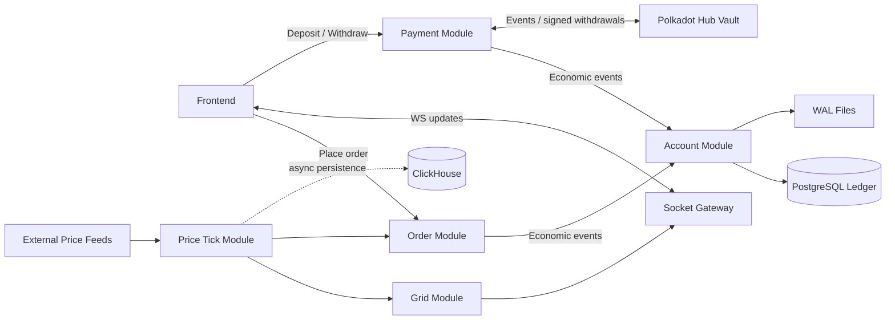

# PolkaTap on Polkadot Hub

PolkaTap, a real-time price-grid betting platform integrated with the Polkadot Hub blockchain.

This repository contains the services that power pricing, grid generation, order execution, balance accounting, payment orchestration, and realtime delivery to clients. The onchain custody boundary is intentionally narrow and currently centered on [`smart-contracts/Vault.sol`](./smart-contracts/Vault.sol).

## System Context

PolkaTap keeps latency-sensitive gameplay offchain and uses Polkadot Hub as the settlement and custody boundary for deposits and withdrawals.



## Architecture Highlights

These highlights are distilled from the docs in [`system-design/`](./system-design/).

### 1. Real-time price pipeline

- The Price Tick module ingests exchange data, canonicalizes timestamps, fills gaps when needed, and fans out an ordered tick stream without blocking on persistence.
- ClickHouse is used for historical price storage, while the realtime path stays in memory.

Relevant docs:
- [`system-design/overall.md`](./system-design/overall.md)
- [`system-design/price_tick/price_tick_module.md`](./system-design/price_tick/price_tick_module.md)

### 2. Signed grid generation

- The Grid module converts each canonical price tick into a rolling price-time grid.
- Every cell carries reward metadata and a backend signature so the frontend can submit cryptographically verifiable order intents.

Relevant doc:
- [`system-design/grid/grid_module.md`](./system-design/grid/grid_module.md)

### 3. Low-latency order engine

- Orders are validated on the hot path with duplicate prevention, cutoff checks, and token-bucket rate limiting.
- Active orders live in memory and are bucketed by cell end-time for fast settlement and eviction.
- Order processing emits economic events to the account system instead of mutating balances directly.

Relevant doc:
- [`system-design/orders/order_management.md`](./system-design/orders/order_management.md)

### 4. Strongly consistent balance accounting

- The Account module is the single writer for user balances.
- Per-user serialization is achieved through shard queues.
- WAL records intent durability, PostgreSQL ledger entries record economic facts, and in-memory balance state is treated as a rebuildable projection.

Relevant docs:
- [`system-design/accounts/account_balance_management.md`](./system-design/accounts/account_balance_management.md)
- [`system-design/accounts/WAL_Ledger.md`](./system-design/accounts/WAL_Ledger.md)

### 5. Payment bridge for Polkadot Hub

- The Payment module bridges offchain balances with onchain deposit and withdrawal flows.
- Deposits are driven by trusted onchain events from Polkadot Hub.
- Withdrawals use session-based orchestration, signed approvals, idempotency keys, and account-layer locking to ensure correctness.

Relevant doc:
- [`system-design/payment/payment_module.md`](./system-design/payment/payment_module.md)

## Modules In This Repo

Core NestJS modules live under [`src/modules/`](./src/modules):

| Module | Responsibility |
|---|---|
| `auth` | API auth, JWT, API key guards |
| `socket` | Realtime websocket delivery |
| `price` | Price ingestion, OHLC, tick distribution |
| `grid` | Grid snapshot computation and signing |
| `order` | Order placement, active-order lifecycle, settlement |
| `account` | Balance state, WAL, ledger, shard queues |
| `payment` | Deposit / withdraw orchestration with Polkadot Hub |
| `distribution` | Distribution and downstream fund flow support |
| `health-check` | Service health endpoints |

## Onchain Boundary

The only contract surface that should be highlighted in this repository is:

| File | Role |
|---|---|
| [`smart-contracts/Vault.sol`](./smart-contracts/Vault.sol) | PolkaTap custody vault for LP shares, trader deposits/claims, and solvency reporting used by the Polkadot Hub integration boundary |

All other older contract descriptions have been intentionally omitted from this README because they are not the active focus of this backend repository.

## Local Development

### Prerequisites

- Node.js
- npm
- Docker / Docker Compose

### Infrastructure services

The repo provides local containers for PostgreSQL, Redis, MinIO, Kafka, ZooKeeper, and ClickHouse:

```bash
cp docker.env.example docker.env
docker compose up -d
```

### Application setup

1. Create `.env` with the variables required by [`src/config/index.ts`](./src/config/index.ts).
2. Install dependencies.
3. Start the backend.

```bash
npm install
npm run dev
```

The app starts with:

- REST API under `/api`
- Swagger in non-production at `/swagger`
- WebSocket support via the socket module

## Useful Commands

```bash
npm run dev
npm run build
npm run test
npm run test:e2e
npm run migration:up
```

## References

- [`system-design/`](./system-design/)
- [`onchain-events.md`](./onchain-events.md)
- [`ADAPTER_GUIDE.md`](./ADAPTER_GUIDE.md)
- [`cre-export-api.md`](./cre-export-api.md)
