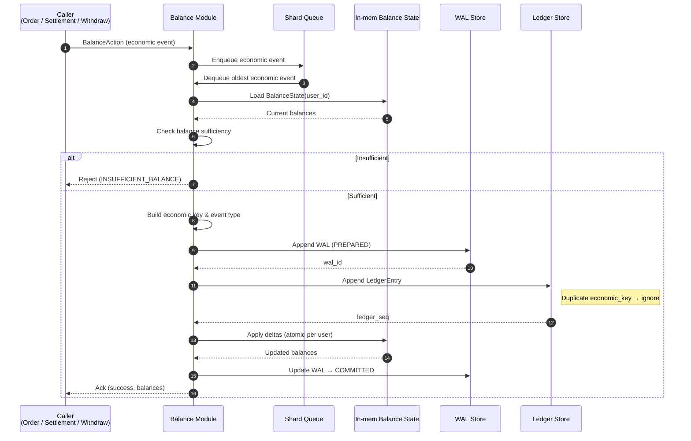

# Account Balance Management Module

This document describes the **Account Balance Management module**

The goal is to clearly define:

* Balance state
* Core invariants
* Supported balance mutations
* The canonical balance update flow
* Latency and concurrency assumptions
* User shard queue to convert economic events to a user from concurrent -> sequential
---

## 1. Balance Types & Semantics

Each user has three balance types:

### free_balance

* Used for betting and withdrawals

### free_tap_balance

* Used for betting only
* **Must never be withdrawable**

### locked_balance

* Funds locked by active bets or pending withdrawals

---

### 1.1 Global Invariant

```
free_balance + free_tap_balance + locked_balance = total_balance
```

No mutation is allowed to violate this invariant.

---

## 2. Balance State (In-memory View)

```ts
struct BalanceState {
  user_id: string

  free_balance: Decimal
  free_tap_balance: Decimal
  locked_balance: Decimal

  last_ledger_seq: u64
}
```

Properties:

* This is the **working state** for the hot path
* It is **not** the source of truth
* It can always be fully rebuilt from the Ledger

---

## 3. Supported Balance Mutations

This module only accepts **economic mutations** that have already passed domain-level validation upstream.

| Mutation            | Effect                     |
| ------------------- | -------------------------- |
| Deposit confirmed   | `free_balance += amount`   |
| Bet place           | `free / free_tap → locked` |
| Bet WIN             | `locked → free`            |
| Bet LOSE            | `locked -= amount`         |
| Withdraw request    | `free → locked`            |
| Withdraw complete   | `locked -= amount`         |
| Refund / correction | Domain-defined             |

---

## 4. Bet-specific Rules

### 4.1 Bet Placement Deduction Order

When placing a bet with `bet_amount`:

1. Deduct from **free_tap_balance first**
2. Deduct the remaining amount from **free_balance**
3. Add the full `bet_amount` to `locked_balance`

Pseudo-logic:

```
use_tap = min(bet_amount, free_tap_balance)
use_free = bet_amount - use_tap

free_tap_balance -= use_tap
free_balance -= use_free
locked_balance += bet_amount
```

---

### 4.2 Bet Settlement

**WIN**:

```
locked_balance -= bet_amount
free_balance += bet_amount * reward_rate
```

**LOSE**:

```
locked_balance -= bet_amount
```

---

## 5. Unified Balance Update Flow

Applied uniformly to all balance mutations.

1. Receive mutation (economic event)
2. Validate pre-conditions (sufficiency, state)
3. Persist the economic event (Ledger path)
4. Apply deltas to `BalanceState`
5. Emit result / acknowledgement

❗ `BalanceState` must **never** be updated before persistence succeeds.

---

## 6. Idempotency Assumptions

* Every mutation carries an **economic idempotency key**
* Duplicate mutations must **not** change balance state
* This module does **not generate** idempotency keys — it only enforces them

---

## 7. User Shard Queue

### 7.1 Goals

* Ensure **per-user serialization** of balance-affecting requests
* Support high concurrency (≈50k users, ≈20k simultaneous orders)
* Maintain <200 ms visible latency per action
* Serialize **only** requests touching the Account Balance module

---

### 7.2 Shard Strategy

* Assign shard by `hash(user_id) % N_SHARDS`
* Each shard contains:

  * An in-memory FIFO request queue
  * A single-threaded or actor-based worker processing requests sequentially

#### Notes

* Hashing guarantees all balance mutations for a user hit the same shard
* This avoids cross-shard concurrency issues
* `N_SHARDS` is chosen to balance CPU utilization and memory footprint

---

## 8. Latency Targets (Module-level)

| Step                            | Target   |
| ------------------------------- | -------- |
| In-memory balance check         | < 1 ms   |
| Full mutation (persist + apply) | < 10 ms  |
| Visibility to caller            | < 200 ms |

---

## 9. Concurrency Assumptions

* Module logic assumes **single-writer semantics per user**
* Internal logic is **not thread-safe**
* Concurrency control is the responsibility of the outer wrapper (shard / actor)

---

## 10. Failure & Recovery Model

* In-memory state may be lost at any time
* Recovery is performed by:

  * Loading the latest snapshot
  * Replaying Ledger events

No state is allowed to exist **only in memory**.

---

## 11. Design Boundary

This module:

* ❌ Does not manage shards or queues
* ❌ Does not handle API retries
* ❌ Does not validate domain rules (cutoff, duplicate orders, etc.)

This module:

* ✅ Guarantees balance correctness
* ✅ Enforces economic invariants
* ✅ Is deterministic and replay-safe

> **Account Balance Management is a deterministic state machine for a single user’s balance.**

---

## Sequential Flow: Balance Update (Request → In-memory State)



### Notes

* Balance sufficiency is always checked against in-memory state (authoritative fast path)
* WAL is written **before** mutating in-memory balance to guarantee crash recovery
* Ledger is append-only and ordered by `ledger_seq`
* In-memory updates must be atomic per user (single-threaded or CAS-guarded)
* Callers may safely retry the same economic event — idempotency is enforced by WAL/Ledger
