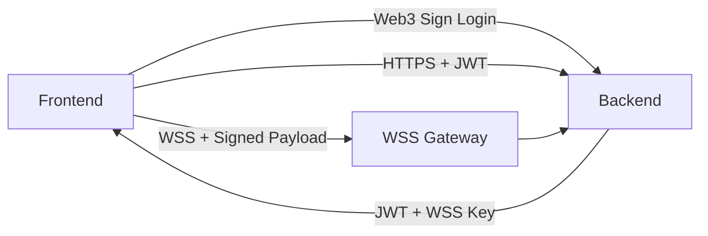

# Authorization Architecture (Web3 + JWT + WSS)

## 1. Purpose & Goals

This architecture defines how **user identity, session authentication, and realtime authorization** are handled in a Web3-based system with both HTTPS and WebSocket (WSS) traffic.

Primary goals:

* Web3-native identity verification
* Clear separation between **authentication** and **authorization**
* Low-latency, cryptographically verifiable realtime actions
* Minimal blast radius in case of key leakage

---

## 2. Core Principles

* **Wallet = Identity**
* **JWT = HTTP session authentication**
* **WSS signing key = realtime authorization**

Each credential has a single responsibility and a well-defined lifetime.

---

## 3. Login & Authentication Flow (Web3)

1. Frontend (FE) requests a login challenge from Backend (BE)
2. BE generates a random, single-use challenge message
3. User signs the challenge using their Web3 wallet
4. BE verifies the signature and recovers the wallet address
5. Upon success, BE issues:

   * An **HTTP JWT**
   * A **WSS Signing Key** with strict TTL

---

## 4. Issued Credentials

### 4.1 HTTP JWT

**Purpose**:

* Authenticate HTTPS requests
* Fetch historical data
* Fetch user profile and bootstrap state

**Properties**:

* Medium-lived (minutes to hours)
* Stateless verification
* Scoped to non-realtime, non-critical operations

---

### 4.2 WSS Signing Key

**Purpose**:

* Authorize realtime actions (e.g. place bet)

**Properties**:

* Short-lived (e.g. 30–120 seconds)
* High-entropy secret
* Stored server-side (in-memory or fast KV)
* Bound to a single user session
* Revocable at any time

---

## 5. Request Types & Authorization

### 5.1 HTTPS Requests

* Transport: HTTPS
* Authentication method: JWT

```
Authorization: Bearer <JWT>
```

**Typical use cases**:

* Fetch user information
* Fetch historical data
* Application bootstrap

---

### 5.2 WSS Realtime Requests

* Transport: Secure WebSocket (WSS)
* Authorization: Per-message signature using WSS signing key

Example payload:

```ts
struct WssRequest {
  action: string
  payload: any
  ts: Timestamp
  nonce: number
  signature: bytes
}
```

Signature scheme:

```
sign(
  hash(action | payload | ts | nonce),
  wss_signing_key
)
```

---

## 6. Server-side Verification (WSS)

For every incoming WSS message, the server performs:

1. Resolve session by connection ID
2. Load associated WSS signing key
3. Verify signature correctness
4. Verify nonce monotonicity (anti-replay)
5. Verify key TTL validity
6. Forward authorized request to business logic

JWTs are **never accepted** on WSS paths.

---

## 7. High-level Architecture



---

## 8. Security Considerations

* Wallet private keys are only used during login

* WSS signing keys:

  * Have short TTLs
  * Are scoped to a single session
  * Can be rotated or revoked

* Replay attacks are mitigated via nonce or sequence numbers

---

## 9. Failure Handling & Credential Recovery

### 9.1 WSS Signing Key Expiry

* When the WSS signing key reaches TTL expiration:

  * If the HTTP JWT is **still valid**:

    * Frontend (FE) must issue an **HTTPS request** to claim a new WSS signing key
    * Backend (BE) verifies JWT and issues a fresh WSS signing key with new TTL
  * If the HTTP JWT is **expired**:

    * FE must perform a **full re-login** (Web3 signature flow)

This ensures that realtime authorization keys are always derived from a valid authenticated session.

---

### 9.2 JWT Expiry

* When JWT expires:

  * All associated WSS signing keys are considered invalid
  * FE must re-authenticate via Web3 login

---

### 9.3 WSS Disconnect

* On WSS connection close:

  * Associated WSS signing key may be invalidated immediately or left to expire naturally (implementation choice)
  * FE must re-establish WSS connection and ensure a valid signing key is available

---

## 10. Performance Considerations

* No database access on hot WSS authorization path
* Signature verification must be sub-millisecond
* Session and key lookups via in-memory or fast KV store

---

## 11. Summary

This authorization architecture provides:

* Strong Web3-based identity guarantees
* Clean separation between HTTP authentication and realtime authorization
* Secure, low-latency handling of critical realtime actions

It is designed for **high-frequency, low-latency systems** such as betting or trading platforms.
