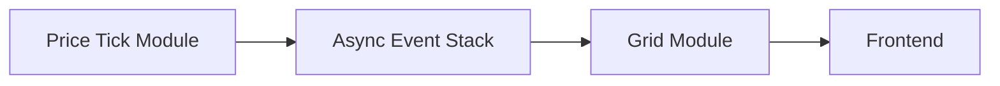

# Grid Module

## 1. Scope & Responsibility

The **Grid Module** is responsible for:

* Receiving **PriceTick events** from the Price Tick Module
* Serializing processing via an **async event stack** (always process only the latest PriceTick and ignore any older ticks that have not yet been handled)
* Computing the **Grid state** for each PriceTick, including:

  * Cell coordinates (X: time, Y: price)
  * Reward rate for each cell
  * Backend (BE) cryptographic signature for each cell
* Streaming realtime **PriceTick + Grid** data to the Frontend (FE)

The Grid Module is a **pure computation and signing layer**:

* Holds no financial state
* Does not interact with Account or Order modules
* Does not require idempotency guarantees

---

## 2. Input & Output Contract

### 2.1 Input: PriceTick Event

```ts
struct PriceTick {
  ts: Timestamp
  price: Decimal
  source: 'Binance' | 'OKX' | ...
}
```

---

### 2.2 Output: Grid Snapshot

```ts
struct GridSnapshot {
  ts: Timestamp          // price tick timestamp
  price: Decimal         // current price
  grid: Grid
}
```

---

## 3. Core Data Types

### 3.1 Cell

```ts
struct Cell {
  price_lower: Decimal
  price_upper: Decimal

  time_start: Timestamp
  time_end: Timestamp

  reward_rate: Decimal   // > 1.0
  signature: bytes       // BE signature over cell fields
}
```

### 3.2 Grid

```ts
struct Grid {
  ts: Timestamp          // timestamp of the price tick
  rows: number           // price dimension (Y)
  cols: number           // time dimension (X)
  cells: Cell[][]        // m x n matrix
}
```

---

## 4. High-level Architecture



---

## 5. Processing Model

### 5.1 Async Event Stack

The async event stack guarantees:

* LIFO semantics by PriceTick
* Single-consumer processing
* Automatic dropping of stale PriceTicks that were not yet processed (can occur during bursty price updates)

---

### 5.2 Grid Computation

For each PriceTick:

1. Identify the **current cell** that contains `(price, ts)`
2. Identify future cells along the time axis (X)
3. For each cell:

   * Compute the reward rate based on:

     * Time distance from the current tick
     * Price distance from the current price
4. Sign each cell:

```
sign(cell_fields, server_private_key)
```

---

### 5.3 Grid Windowing

* The grid only covers a **rolling window**:

  * Time: `[ts, ts + T]`
  * Price: `[price - Δp, price + Δp]`

* Grid dimensions `m × n` are **fixed and configurable**

---

## 6. Streaming to Frontend

* Each PriceTick produces exactly one GridSnapshot
* Payload includes:

  * Current price
  * Timestamp (`ts`)
  * Full grid (cells, reward rates, and signatures)

**Latency target**:

* GridSnapshot visible at FE within **≤ 200ms**

---

## 7. Signature Semantics

### Purpose

* FE sends back `cell + reward_rate + signature` when placing an order
* Order Module verifies the backend signature

### Signed Fields

```
grid.ts
price_lower
price_upper
time_start
time_end
reward_rate
```

> ❗ Signatures are **not user-bound**; they only bind the economic definition of a cell

---

## 8. Failure & Backpressure Awareness

### Slow Frontend Consumers

* WebSocket fanout layer is responsible for buffering
* Grid Module must never block due to slow FE consumers

---

## 9. Performance & Scaling

| Metric       | Target        |
| ------------ | ------------- |
| Tick dequeue | 1-by-1        |
| Grid compute | < 5ms         |
| Grid size    | m × n (fixed) |

* CPU-bound workload
* Horizontally scalable via **replication and partitioning by symbol**

---

## 10. Security & Correctness Awareness

* Cell-signing private keys must reside in an HSM or secure enclave
* Reward rate computation must be deterministic
* Grid computation must depend **only** on PriceTick and static configuration

---

## 11. Summary

The **Grid Module** is a **deterministic realtime computation layer**:

* Strictly ordered
* Stateless across ticks
* Cryptographically verifiable

It forms the direct bridge between **market movement** and **user decision-making (bet placement)**.

---

## Awareness Points

### 1. Dropped PriceTicks Under High Load

* Some PriceTicks may be skipped during bursts
* Users cannot exploit skipped intervals because:

  * No backend signature exists for skipped cells
  * Replay attacks are not possible

---

### 2. Latency & Time Budget

* End-to-end latency from PriceTick reception to GridSnapshot emission must stay within a **tight SLA**

---

### 3. High-Complexity Grid Algorithms

* Grid computation may be computationally expensive (e.g. large `m × n`, complex reward logic)
* To meet time budgets:

  * Parallelism may be used **within a single PriceTick computation**
  * Typical strategies:

    * Partition by rows, columns, or cell blocks
    * Workers compute subsets of cells
    * Final grid is assembled in a single-threaded merge step

---

### 4. Controlled Concurrency

* Parallelism is allowed **only inside a single PriceTick**
* Never process multiple PriceTicks concurrently to avoid:

  * Race conditions
  * Non-deterministic grid states
  * Signature inconsistencies

---

### 5. Thread Safety & Immutability

* Inputs (`price`, `ts`, `grid_config`) must be treated as **immutable**
* Worker threads must not mutate shared state
* Only the final aggregation step constructs the GridSnapshot

---

### 6. Signature Correctness Under Parallelism

* Cell signatures must be generated **after** cell data is finalized
* Signing keys must not be shared unsafely across threads
* Signature generation may be:

  * Centralized in the main thread, or
  * Performed in workers using thread-safe cryptographic primitives

---

### 7. Observability

Metrics to track:

* Grid computation time per tick
* Async stack / queue depth
* Worker utilization
* Dropped PriceTick count

Alerts should trigger when computation time approaches the SLA limit.
