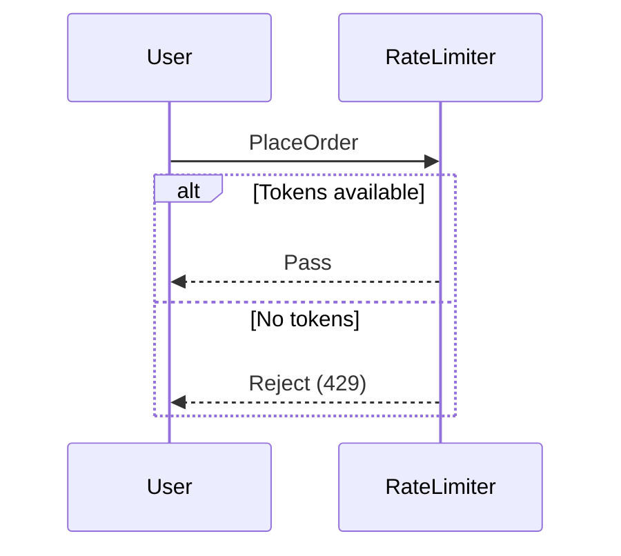
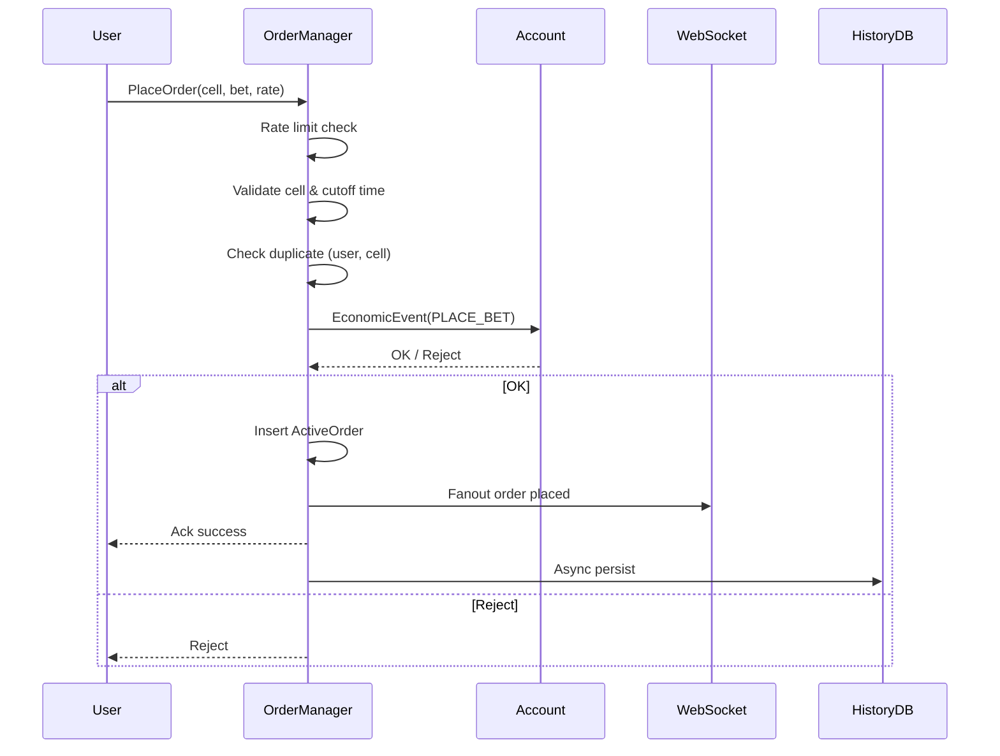
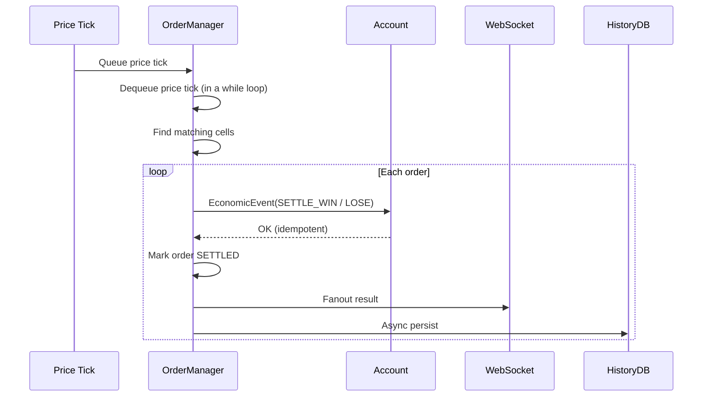

# Order Management Module

## 1. Scope & Responsibilities

The **Order Management module** is responsible for the real-time lifecycle of user orders, from placement to settlement.

It is explicitly **not responsible for balances** and interacts with the Account Balance module **only via Economic Events**.

Core responsibilities:

* Accept and validate **place order** and **settle order** requests
* Protect the system from spam and abuse via **token-bucket rate limiting**
* Manage **active orders in memory** with ultra-low latency
* Generate **Economic Events** and forward them to the Account module
* Fan out real-time results to users via WebSocket
* Persist **order history asynchronously** (non-blocking for the fast path)

---

## 2. Core Invariants

* A user **cannot place more than one order in the same cell**
* An order is valid only if the **cell timestamp is still in the future window**
* Each order can be settled **at most once** (WIN or LOSE)
* Users must observe place / settle results within **≤ 200 ms (p99)**

---

## 3. Data Models (Logical)

### 3.1 Cell & Order Identity

```ts
CellID  = hash(price_lower + price_upper + time_start + time_end)
OrderID = hash(user_id + CellID)
```

**Invariant:**

* For each `(user_id, CellID)`, **at most one OrderID exists**
* This invariant is enforced **in memory**, independent of database state

---

### 3.2 User–Cell Index (Anti-duplication)

A lightweight structure ensuring *"one bet per user per cell"*:

```ts
// Per-user lightweight index
Map<UserID, Set<CellID>> user_cell_index
```

Properties:

* O(1) check during order placement
* Inserted only after Account module ACKs the economic event
* Removed when the order is **SETTLED** or **EVICTED**

---

### 3.3 ActiveOrder (In-memory)

```ts
struct ActiveOrder {
  order_id: string
  user_id: string
  cell_id: string

  cell_time_start: Timestamp
  cell_time_end: Timestamp

  bet_size: Decimal
  reward_rate: Decimal

  placed_at: Timestamp
  settle_status: 'OPEN' | 'SETTLED'
}
```

---

### 3.4 Active Orders Storage (Time-bucketed)

Active orders are stored **by time-axis buckets (cell end time)**:

```ts
// Key = cell_time_end bucket
Map<CellTimeBucket, Map<OrderID, ActiveOrder>> active_orders_by_bucket
```

Where:

* `CellTimeBucket = floor(cell_time_end / BUCKET_SIZE)`
* `BUCKET_SIZE` typically equals the cell width (e.g. 5s, 10s)

Benefits:

* Efficient batch settlement on price ticks
* O(1) eviction of all orders when a cell closes

---

### 3.5 Secondary Indexes

```ts
Map<OrderID, ActiveOrder> active_orders_by_id
```

Used for:

* Direct settlement by `order_id`
* Debugging and observability

---

## 4. Rate Limiting (Token Bucket)

### Design

* One token bucket per user
* Capacity: configurable (e.g. 10 requests)
* Refill rate: N tokens per second

### Enforcement

* Applied **before all validation logic**
* Early rejection protects CPU and in-memory structures



---

## 5. Active Orders In-memory Design

### 5.1 Partitioning

* Partitioned by **time bucket (cell end timestamp)**
* Each bucket contains orders sharing the same cell window

```text
ActiveOrders
 ├─ bucket[t0]
 │   ├─ order A
 │   └─ order B
 ├─ bucket[t1]
 │   └─ order C
```

---

### 5.2 Indexes

* `(user_id, cell_id)` → prevent duplicate placement
* `order_id` → direct settlement and lookup

---

### 5.3 Eviction

When a cell closes (price exits the time window):

* All **OPEN** orders in the bucket are settled as **LOSE**
* The entire bucket is dropped from memory

---

## 6. Flow: Place Order



### Latency Notes

* Fast path (rate limit → in-mem → WS): **< 50 ms**
* Account module call budget: **~10–20 ms**

---

## 7. Flow: Settle Order (WIN / LOSE)



### Settlement Notes

* Settlement may be **batched by cell**
* The Account module guarantees idempotency

---

## 8. WebSocket Fanout

* Fanout occurs **only after Account ACK**
* Payload is minimal (`order_id`, `status`, `pnl`)
* Must never block the order flow

---

## 9. Asynchronous History Persistence

* Fire-and-forget writes
* Retry and DLQ supported
* Must not affect user-facing latency

---

## 10. Concurrency & Latency Targets

| Metric                 | Target         |
| ---------------------- | -------------- |
| Place order visible    | ≤ 200 ms (p99) |
| Settle visible         | ≤ 200 ms (p99) |
| Concurrent placements  | 20k            |
| Concurrent settlements | 20k            |

---

## 11. Failure Awareness

* Account rejection → rollback order creation
* WebSocket failure → client retry / reconnect
* DB failure → async retry, no impact on core flow

---

## 12. Summary

The Order Management module is a **stateless fast-path + stateful in-memory** system:

* CPU-cheap
* Memory-bounded
* Account-safe
* Real-time friendly
