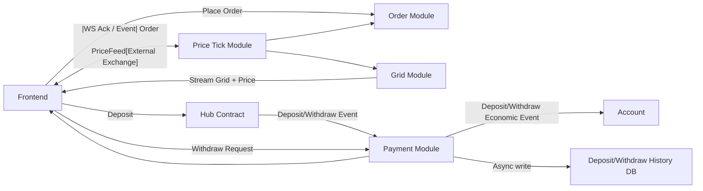

# System Architecture Overview

## 1. Goals

* **Real-time betting on price grids** for crypto (BTC/ETH)
* **Low-latency user experience** (<200ms for order place / settlement)
* **High concurrency**: 50k users, 20k simultaneous place orders / settlement
* **Strong consistency** for account balances
* **Event-driven, modular architecture**

---

## 2. Key Touch Points / Modules

| Module            | Responsibility                                           | Interfaces / Touch Points                                                             |
| ----------------- | -------------------------------------------------------- | ------------------------------------------------------------------------------------- |
| FE                | User interface (Web3 wallet, order placement, live grid) | WebSocket, HTTP API                                                                   |
| Hub Contract      | Blockchain smart contract                                | Emits deposit/withdraw events, accepts signed withdraw transactions                   |
| Price Feed        | External exchange (Binance/OKX)                          | Streaming API (TS, Price)                                                             |
| Price Tick Module | Consume feed, fill gaps, generate PriceTick events       | Async queue → Grid Module, Order Module                                               |
| Grid Module       | Compute price grid + reward rate + cell signature        | FE WebSocket, uses PriceTick events                                                   |
| Account Module    | Manage in-memory balances, WAL, ledger, User shard queue | Receives economic events from Order Module, Payment Module                            |
| Order Module      | Place/settle orders, active order memory                 | Calls Account Module for balance check/update, emits WS to FE, async history persist  |
| Payment Module    | Deposit/withdraw handling                                | Interacts with FE, Hub Contract, Account Module, Deposit/Withdraw History DB          |

---

## 3. High-Level Data Flow (Mermaid)

---

## 4. Awareness Points

* **Low-latency critical path**: Place order, settle order, update balance, active order memory, WS fanout (<200ms)
* **High throughput**: Shard queue allows per-user serialization; multiple shards process users concurrently
* **Consistency**: Account module is single-writer per user; ledger/WAL is source of truth
* **Resilience**: Payment module handles retries, idempotency; WAL + ledger allow replay after crash
* **Scalability**: PriceTick and Grid modules may use multi-threading; active orders in-memory, partitioned by cell bucket
* **Observability**: Queue depths, processing latency, worker utilization, WS delivery, shard load
