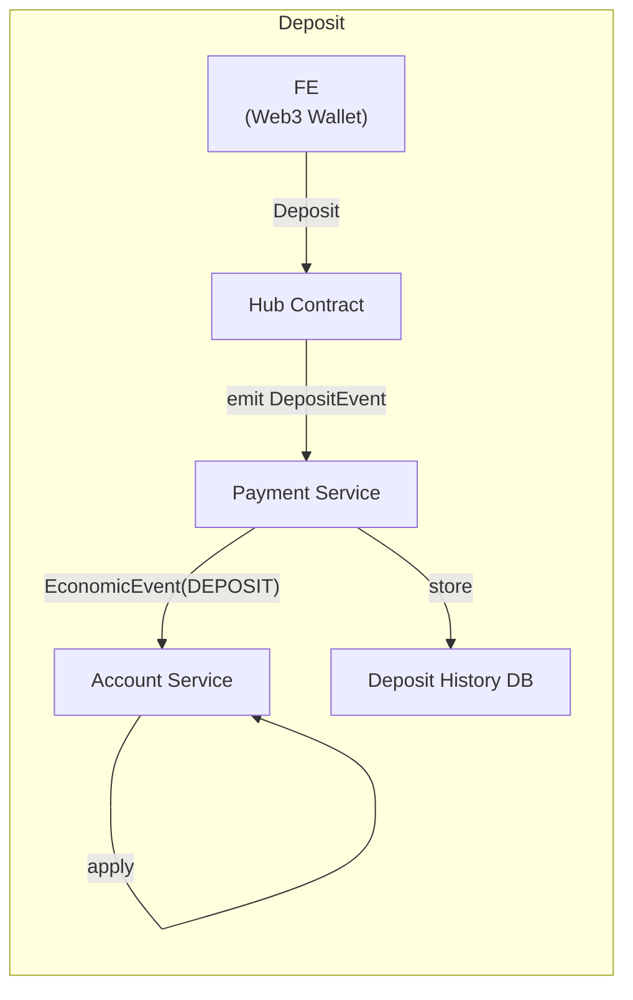
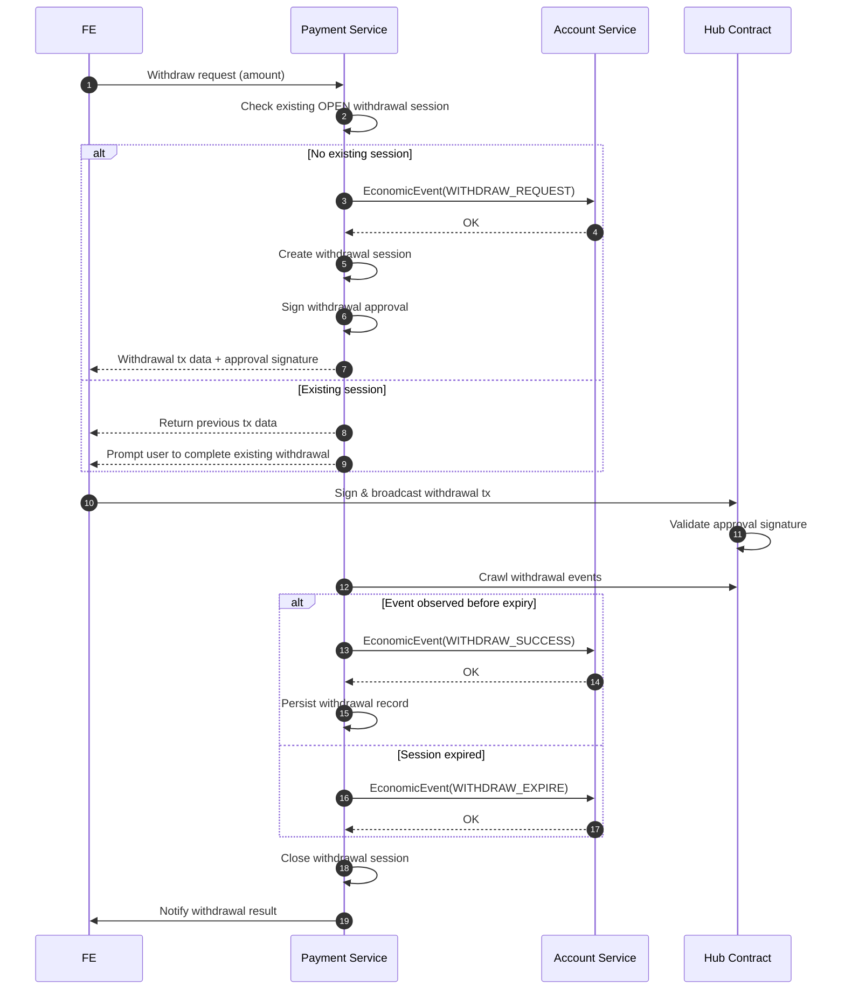

# Payment Module (Deposit & Withdrawal)

## 1. Scope & Philosophy

The **Payment Module** acts as a bridge between **on-chain activity** and the **Account Balance module**.

It is responsible for:

* Receiving and validating **on-chain events** (deposits, withdrawals)
* Managing **withdrawal sessions** spanning off-chain → on-chain → off-chain
* Emitting **Economic Events** to the Account Service

**Design philosophy**:

* Prioritize **consistency and correctness** over raw latency
* Concurrency is low → multi-step, session-based flows are acceptable
* The Account Service remains the **single source of truth for balances**

---

## 2. Core Invariants

* Each **deposit `tx_hash` & `log_index`** is accounted for **at most once**
* Each **withdrawal `tx_hash` & `log_index`** is accounted for **at most once**
* Each **withdrawal session** is settled **exactly once** (SUCCESS or EXPIRED)
* At most **one OPEN withdrawal session** may exist per user
* All balance mutations occur **only via Account Economic Events**

---

## 3. Deposit Flow (On-chain → Off-chain)

### 3.1 High-level Flow



---

### 3.2 Deposit Processing Details

Upon receiving `DepositEvent(tx_hash, user_id, amount)`:

1. **Validate event**

   * `tx_hash` has not been processed before
   * Event originates from the trusted Hub Contract

2. **Build Economic Event**

```ts
EconomicEvent {
  event_type: DEPOSIT
  user_id
  tx_hash
  log_index
  deltas: {
    free_balance: +amount
  }
}
```

3. **Send to Account Service**

   * The Account Service enforces idempotency using `tx_hash` & `log_index`

4. **Persist deposit history** (async-safe)

---

### Deposit Notes

* **Idempotency key:** `tx_hash`
* Payment Service may crash or replay events — Account remains safe
* No session is required because deposits are **push-based on-chain events**

---

## 4. Withdrawal Flow (Off-chain → On-chain → Off-chain)

### 4.1 Withdrawal Sequence



---

## 5. Withdrawal Session Model

```ts
struct WithdrawalSession {
  session_id: UUID
  user_id: string
  amount: Decimal

  status: OPEN | SUCCESS | EXPIRED

  approval_signature: bytes
  created_at: Timestamp
  expires_at: Timestamp
}
```

---

## 6. Account Economic Events (Withdrawal)

### 6.1 Withdraw Request (Lock funds)

```ts
EconomicEvent {
  event_type: WITHDRAW_REQUEST
  user_id
  session_id
  deltas: {
    free_balance: -amount
    locked_balance: +amount
  }
}
```

---

### 6.2 Withdraw Success

```ts
EconomicEvent {
  event_type: WITHDRAW_SUCCESS
  user_id
  session_id
  tx_hash
  log_index
  deltas: {
    locked_balance: -amount
  }
}
```

---

### 6.3 Withdraw Expire / Cancel

```ts
EconomicEvent {
  event_type: WITHDRAW_EXPIRE
  user_id
  session_id
  deltas: {
    locked_balance: -amount
    free_balance: +amount
  }
}
```

---

## 7. Idempotency & Consistency

### Idempotency Keys

| Action           | Idempotency Key        |
| ---------------- | ---------------------- |
| Deposit          | `tx_hash`              |
| Withdraw request | `session_id`           |
| Withdraw success | `session_id + tx_hash` |
| Withdraw expire  | `session_id`           |

* The Account Service enforces idempotency internally using economic keys

---

## 8. Failure & Edge Cases

### Payment Service Crash

* Deposit replays are safely deduplicated by Account
* Withdrawal sessions are recoverable from persistent storage

### User Never Broadcasts Withdrawal Transaction

* Session expires automatically
* Funds are unlocked via `WITHDRAW_EXPIRE`

### Chain Reorganization (Deposits)

* Optional confirmation depth (N blocks)
* Payment Service emits deposit events only after finality threshold

---

## 9. Latency Expectations

| Flow                         | Expected Latency     |
| ---------------------------- | -------------------- |
| Deposit reflected in balance | Seconds (block time) |
| Withdraw request             | < 100 ms             |
| Withdraw finalization        | Block time           |

---

## 10. Summary

The Payment Module is a **consistency-first orchestrator**:

* Does not own balances
* Does not require high concurrency
* Uses session-based withdrawal flows
* Relies on the Account Service for final correctness

This design is robust against:

* Retries
* Crashes
* Duplicate on-chain events
* Partial or abandoned user actions
