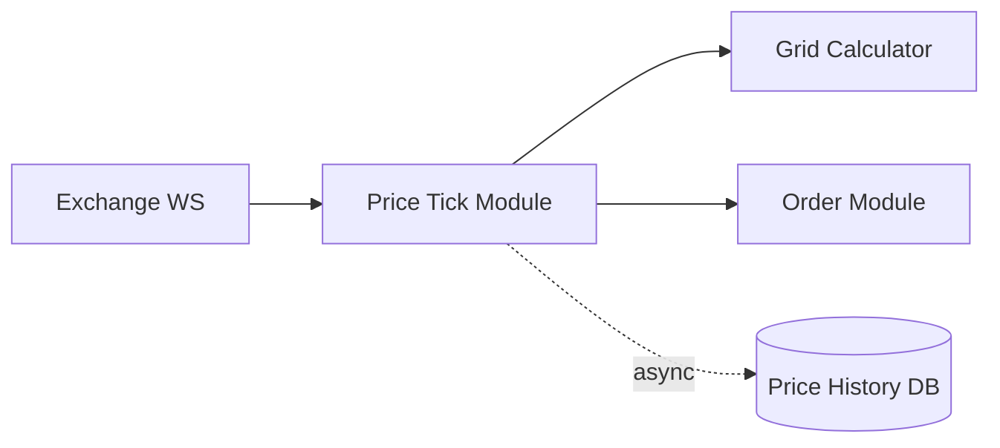

# Price Tick Module

## 1. Scope & Responsibility

The **Price Tick Module** is responsible for:

* Streaming real-time prices from **external exchanges** (Binance / OKX)
* Normalizing price data into the canonical form `(ts, price)`
* Generating **synthetic / virtual price ticks** to fill time gaps
* Real-time fanout of **PriceTick events** to:

  1. Grid Calculator
  2. Order Management (settlement)
* Persisting price data **asynchronously** (must not affect the realtime path)

**Core objective**: provide a **continuous, strictly time-monotonic, ultra-low-latency** PriceTick stream.

---

## 2. Input & Output Contract

### 2.1 Input (From Exchange)

```ts
struct RawPriceEvent {
  exchange: 'BINANCE' | 'OKX'
  ts: Timestamp        // exchange timestamp
  price: Decimal
}
```

### 2.2 Output (Internal PriceTick)

```ts
struct PriceTick {
  ts: Timestamp        // canonical timestamp
  price: Decimal
  source: 'REAL' | 'SYNTHETIC'
}
```

---

## 3. High-level Architecture



---

## 4. Core Processing Pipeline

### 4.1 Ingest

* Establish WebSocket connections to exchanges
* Receive raw price events
* Validate:

  * `ts` is valid
  * `price > 0`

---

### 4.2 Timestamp Canonicalization

**Key awareness**:

* Exchange timestamps ≠ server timestamps
* The system must operate on a **single global time axis**

Canonical rule:

```
canonical_ts = min(exchange_ts, server_receive_ts)
```

Invariant:

* `PriceTick.ts` **must never move backward**

---

### 4.3 Gap Filling (Synthetic Price)

When detecting:

```
Δt = ts_now - ts_prev > GAP_THRESHOLD
```

→ invoke a **price interpolation algorithm** (algorithm-agnostic at this layer)

Output:

* A sequence of `PriceTick(ts_i, price_i, source = SYNTHETIC)`
* Prices fluctuate slightly around the last real price

**Objectives**:

* Prevent Grid and Order modules from freezing
* Avoid introducing artificial arbitrage opportunities

---

### 4.4 Realtime Fanout

* For every `PriceTick` (real or synthetic):

  * Emit immediately
  * Do **not** wait for persistence

Target latency:

* **≤ 10ms end-to-end** (ingest → fanout)

---

### 4.5 Async Persistence

* Batch-write to Price History DB
* May drop data if backlog grows too large
* Must never block or slow down the realtime stream

---

## 5. Price History Storage (Logical)

```ts
struct PriceRecord {
  ts: Timestamp
  price: Decimal
  source: 'REAL' | 'SYNTHETIC'
}
```

* Append-only
* Indexed by `ts`

---

## 6. Interaction with Order Management (Settlement)

* Order module subscribes to the PriceTick stream
* Settlement is triggered when:

  * Price crosses a grid cell boundary (Y-axis)
  * A time bucket closes (X-axis)

**Guarantee**:

* Order module receives PriceTicks **strictly ordered by `ts`**

---

## 7. Interaction with Grid Calculator

* Grid Calculator uses PriceTicks to:

  * Highlight the current grid cell
  * Animate price movement

Realtime requirements are identical to those of the Order Module

---

## 8. Latency & Performance Targets

| Metric             | Target     |
| ------------------ | ---------- |
| PriceTick latency  | ≤ 10ms     |
| Tick throughput    | 10k+ / sec |
| Fanout subscribers | 2–5        |

---

## 9. Failure & Edge Case Awareness

### Exchange Disconnect

* Auto-reconnect and/or switch to backup sources
* If reconnection fails:

  * Freeze chart updates
  * Order timestamp validation must be strong enough to prevent exploits even under stale prices

### Out-of-order Exchange Events

* Drop events where `ts < last_ts`

### Clock Drift

* Monitor `exchange_ts - server_ts`
* Trigger alerts if drift exceeds a defined threshold

---

## 10. Backpressure Strategy

* When downstream consumers are slow:

  * Prefer dropping **synthetic ticks**
  * Always preserve **real ticks**

---

## 11. Summary

The **Price Tick Module** is the **realtime backbone** of the system:

* Stateless
* Latency-critical
* Highly sensitive to time ordering

All upstream modules (Grid, Order) **directly depend on the correctness and continuity of the PriceTick stream**.